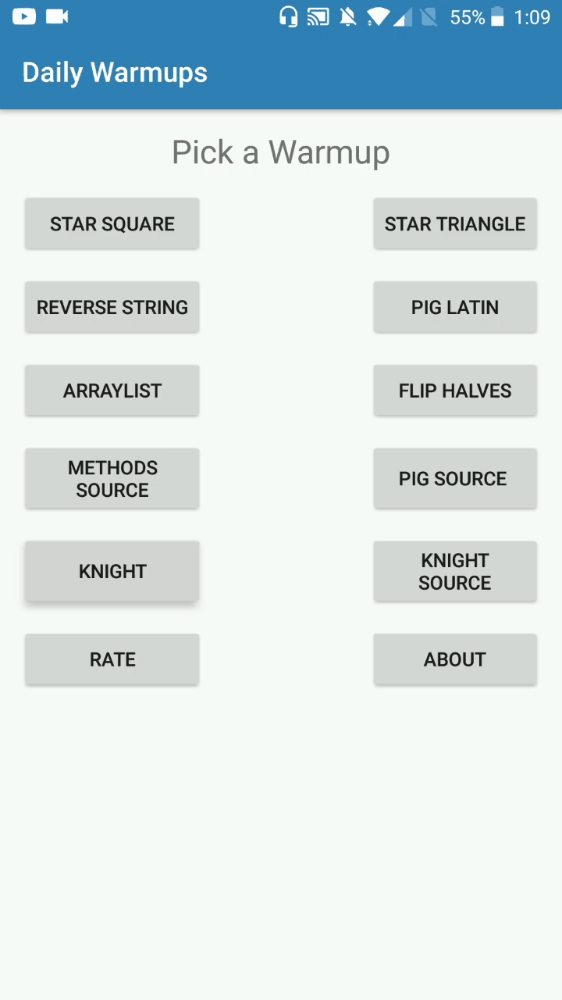
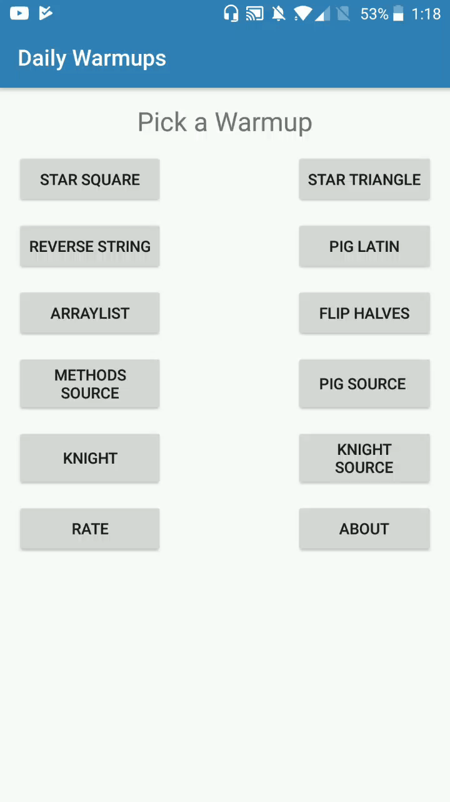

# Daily Warmups     

  

### Screencaptures

| Knight's Tour | Star Square |
|:-:|:-:|
|  |  |
| [`KnightHelper.java`](https://github.com/JavaCafe01/DailyWarmups/blob/master/app/src/main/java/com/gsnathan/dailywarmups/KnightHelper.java) | [`Utils.java`](https://github.com/JavaCafe01/DailyWarmups/blob/master/app/src/main/java/com/gsnathan/dailywarmups/Utils.java) | 

### Download

### Contribute

You can contribute to this project in many ways:
* Become a [Beta Tester][beta]
* Help to translate the application (if so contact me --> gsnathandev@outlookcom)

### License

Daily Warmups is made available under the terms of the [MIT License][mit].

### Credits

|[Andrew da Cunha][user] for the Knight's Tour|
|:-------------------------------------------:|
|Contact him --> andracmat@gmail.com|

[mit]: https://opensource.org/licenses/MIT
[beta]: https://play.google.com/apps/testing/com.gsnathan.dailywarmups
[user]: https://github.com/andracmat
